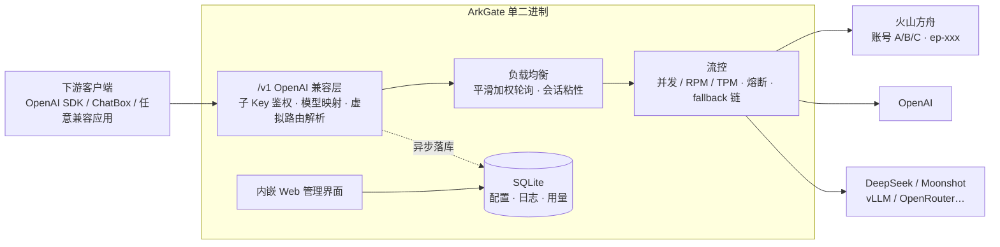

<div align="center">

# ⛵ ArkGate

**多供应商多账号负载均衡 · OpenAI 兼容网关**

把火山方舟 / OpenAI / 任意 OpenAI 兼容供应商的 API Key 放进同一个池子，
下游用统一的 `sk-xxx` 子 Key + 易读模型名调用 —— 选路、限流、熔断、降本，网关全包。

[](https://go.dev)
[](#-openai-兼容端点)
[](#-技术栈)
[](#-技术栈)
[](#-快速开始)
[](#-快速开始)

**[快速开始](#-快速开始) · [功能总览](#-功能总览) · [架构与路由](#-架构与路由) · [虚拟路由模型](#-虚拟路由模型auto) · [配置](#-环境变量)**

</div>

---

## ✨ 功能总览

| | |
|---|---|
| 🔀 **多账号负载均衡** | 多家供应商、十几个账号的 Key 进池子，按**平滑加权轮询 + 会话粘性**自动选路，对下游完全透明。 |
| 🏷️ **易读模型名映射** | Ark 的 `ep-2025xxx`、OpenAI 的 `gpt-4o`……长短不一的接入点标识统一映射成 `doubao-seed-1-6` 这样的易读名，下游只认名字。 |
| 🗣️ **多协议双向桥** | 供应商类型下沉到模型层：同一账号可混布 gpt 系（OpenAI 协议）与 claude 系（Anthropic 协议）模型；**入站也是双协议**——Claude Code 用 `/v1/messages` 直连，tools 全量双向转换，Anthropic 上游原生透传，中间层对两侧完全透明（转换语义参照 cc-switch）。 |
| 🛡️ **叶级熔断与限流** | 并发 / RPM / TPM 限流与熔断只落在「账号 × 接入点」元组上，逐叶独立配置；连续失败指数退避熔断，兄弟叶子自动接管。 |
| 🧠 **虚拟路由模型** | 参考 auto/router 类模型：按**估算输入长度**把请求自动分流到大小模型——短问题走便宜档，长上下文走旗舰档，一个名字对下游。 |
| 🔗 **模态感知 fallback** | 模型分文本 / 图像两类，fallback 链只在同类型内退避、不向下传递；失败请求还会跨叶子重试。 |
| 🔑 **子 Key 体系** | 真实上游 Key 加密落库永不出网关，下发的 `sk-xxx` 可限模型 / 账号 / 当日 Token / 当日图像张数。 |
| 📊 **用量与成本分析** | 请求级日志（含来源 IP、成本）+ 对齐火山方舟「用量统计」的分析页：日期区间 / 天·小时粒度 / 按模型·子Key·账号·接入点·供应商下钻。 |
| 🖥️ **内嵌管理界面** | Vue 3 单页应用随二进制内嵌：账号、模型映射、**可视化分流编排（拖拽 fallback 链 / 路由模型阈值规则）**、子 Key、日志、设置，开箱即用。 |
| 📥 **从上游导入** | 用账号凭据探测上游 `GET /models`，勾选即批量建映射；模型价格 / 上下文窗口按内置 LiteLLM 目录**自动补全**。 |
| 🧾 **子 Key 自助门户** | 终端用户用 `sk-xxx` 登录查看自己的限额、用量、成功率与脱敏调用记录——错误细节、账号信息等运维数据严格隔离。 |

## 🚀 快速开始

```bash
# 构建（Go 1.26+）
go build -o arkgate .

# 运行
./arkgate
```

```text
=============================================================
  检测到首次运行，已生成管理访问令牌：
  ark-xxxxxxxxxxxxxxxxxxxxxxxxxxxxxxxx
  请妥善保存，登录 Web 管理界面时使用。
=============================================================
ArkGate 启动: http://0.0.0.0:8002
```

- 打开 `http://localhost:8002` 进入管理界面，用控制台打印的令牌登录；
- 默认监听 `0.0.0.0:8002`，端口被占用时**自动向后递增**；
- 运行时数据（SQLite + 加密密钥）落在可执行文件同级目录，可用 `ARKGATE_DATA_DIR` 重定向。

### 三步接入

```text
① 添加账号          ② 建模型 + 映射                       ③ 签发子 Key 并调用
─────────────      ──────────────────────────────       ─────────────────────
选供应商 + 填 Key    模型名 doubao-seed-1-6                sk-xxx（可设限额）
（custom 填 baseURL）  └─ 账号 × ep-2025xxx（可多个，权重分流）   ↓
                                                     base_url 指向网关
```

<details open>
<summary><b>▶ 直接可用的调用示例</b></summary>

```bash
curl http://localhost:8002/v1/chat/completions \
  -H "Authorization: Bearer sk-你的子Key" \
  -H "Content-Type: application/json" \
  -d '{
    "model": "doubao-seed-1-6",
    "messages": [{"role": "user", "content": "你好"}],
    "stream": false
  }'
```

图像生成（模型类型需为 image，`size` 等参数按上游语法原样透传）：

```bash
curl http://localhost:8002/v1/images/generations \
  -H "Authorization: Bearer sk-你的子Key" \
  -H "Content-Type: application/json" \
  -d '{"model": "seedream-image", "prompt": "a cat", "n": 2}'
```

</details>

## 📡 OpenAI 兼容端点

任意 OpenAI SDK / 客户端把 `base_url` 指向网关即可：

| 端点 | 说明 |
|---|---|
| `POST /v1/chat/completions` | 对话补全，流式 / 非流式 |
| `POST /v1/messages` | **Anthropic Messages API**（Claude Code 直连，按上游协议自动转换/透传，tools 完整支持） |
| `POST /v1/responses` | Responses API，原生透传 |
| `POST /v1/images/generations` | 文生图 |
| `POST /v1/messages/count_tokens` | Anthropic token 计数（粗估） |
| `GET /v1/models` | 模型列表（按子 Key 白名单过滤） |
| `/api/portal/overview` | 子 Key 自助门户（Bearer sk-xxx） |

请求参数**原样透传**（唯一例外：模型名换成上游标识、输出上限按目录裁剪），上游错误体原样带回，非流式上游超时与流式首字节超时都可在设置页热改。

## 🏗 架构与路由



流控采用**树状拓扑**——账号是父节点（不单独限流/熔断），「账号 × 上游标识」的映射是叶节点（全部流控都在这层）：

```text
账号 Ark-主账号 ─────────────── active/disabled + 统计聚合，不限流不熔断
   ├── 叶：账号 × ep-20250615   weight=3  并发/RPM/TPM 独立配额，熔断独立
   ├── 叶：账号 × ep-20250828   weight=1  ← 同模型多发布版本并存，按权重分摊
   └── 叶：账号 × ep-other      weight=1  ← 这棵叶熔断不影响兄弟

请求路径：sk-xxx 鉴权 → 日限额检查 → 虚拟路由解析 → clamp 输出上限
        → 收集可用叶（启用·未熔断·未超限·能力匹配）→ 平滑 WRR → 替换 Key 与 model → 透传
```

- **权重**：`叶.weight > 账号.weight > 1`，分流配置页可拖拽编排、占比实时预览；
- **重试**：失败把当前叶排除后换下一个，非流式最多 3 次，流式在首字节前同样可跨叶重试；
- **熔断**：连续失败 5 次熔断该叶，1s 起指数退避、上限 60s；客户端侧错误（上下文超限等）不计数；
- **能力过滤**：`responses` / `images` 只路由到支持该能力的账号（供应商默认 × 账号级三态覆盖）；
- **会话粘性**：同一子 Key + 模型在 TTL 内固定到同一叶，提升上游 prompt cache 命中率。

## 🧠 虚拟路由模型（auto）

给「按输入长度自动选模型」的玩法一个目录原生支持：新建 **router** 类型模型，配置升序阈值规则，
客户端只请求这个名字，网关在入口估算输入 tokens 并解析成真实目标：

```text
请求 model="auto" ── 输入估算（CJK≈1字1token，其余≈4字符1token，偏保守）
   ├── ≤ 8K tokens  → doubao-lite   （日常问答，便宜）
   ├── ≤ 128K       → doubao-pro    （长文档，旗舰）
   └── 其余         → 默认目标
```

- 目标可以是文本模型或另一个 router（链式，防环、深度上限 8）；
- 子 Key 只需授权 `auto` 这一个名字；日志里 `requested_model=auto`、`model=实际命中`，分流可审计；
- 估算只用于选路，**计费与用量永远按上游真实 usage 与命中模型定价**。

## 🔐 数据安全

- 上游 API Key 以 **AES-256-GCM** 加密落盘（主密钥存 `DataDir/secret.key`，权限 0600），任何接口只回传末 4 位提示；
- 子 Key 鉴权按 SHA-256 哈希匹配，管理令牌同样哈希存储；
- 门户按列级白名单脱敏——终端用户拿不到账号、接入点、上游错误体等任何运维信息；
- 来源 IP 仅记录在日志供排查（取 XFF 首跳 / X-Real-IP / RemoteAddr），不参与任何鉴权与路由判断。

## ⚙️ 环境变量

| 变量 | 说明 | 默认值 |
|---|---|---|
| `ARKGATE_ADDR` | 监听地址 | `0.0.0.0:8002`（占用自动递增） |
| `ARKGATE_DATA_DIR` | 数据目录（sqlite + secret.key） | 可执行文件同级 |
| `ARKGATE_SECRET` | 固定加密主密钥（可选） | 自动生成存 `secret.key` |
| `ARKGATE_REQUEST_TIMEOUT` | 非流式上游整体超时（秒，0=不限） | `300` |
| `ARKGATE_FIRST_TOKEN_TIMEOUT` | 流式首字节超时（秒，0=关闭），超时换叶重试 | `30` |
| `ARKGATE_SESSION_TTL` | 会话粘性 TTL（秒，0=关闭） | `300` |

> 两个超时可在管理界面「设置」页**热改并持久化**（DB 值 > 环境变量 > 默认），改完对后续请求立即生效，无需重启。

## 🧱 技术栈

| 层 | 选型 | 一句话理由 |
|---|---|---|
| 语言 |  | 单二进制交付、goroutine 天然契合代理转发 |
| 存储 |  | 零 CGO、零外部服务依赖，WAL 模式单写者 |
| 上游 SDK |   | 请求体字节级透传（OpenAI 路径）与 Anthropic 协议转换，跟随官方版本演进 |
| 前端 |  | 免 Node 构建链的全局构建，`go:embed` 内嵌进二进制 |
| 图表 | 手写 SVG（无图表库依赖） | 柱状 / 堆叠 / 折线，随维度联动重绘 |

## 📁 目录结构

```
arkgate/
├── main.go                 # 入口：装配 + 路由（/v1、/api、/ 内嵌前端）
├── internal/
│   ├── config/             # 环境变量配置（含可热改的原子超时）
│   ├── secure/             # AES-256-GCM 加解密
│   ├── model/              # 数据模型 + 滑动窗口（RPM/TPM）
│   ├── store/              # SQLite 持久化（幂等迁移，只增不改）
│   ├── provider/           # 供应商注册表 + openai-go 骨干 + SSE 字节转发
│   ├── balancer/           # WRR + 会话粘性 + 熔断限流 + 能力过滤 + 虚拟路由解析
│   ├── gateway/            # /v1 转发层（chat / responses / images / 路由估算）
│   ├── admin/              # /api 管理接口 + 目录自动补全
│   └── portal/             # 子 Key 自助门户（列级脱敏）
├── web/                    # Vue 3 单页前端（go:embed）
└── docs/                   # 设计文档
```

## 🧪 开发与测试

```bash
go test ./...    # 单测覆盖：WRR/熔断/限流/fallback 语义/虚拟路由/迁移幂等/门户脱敏…
go build -o arkgate . && ./arkgate
```

前端无构建链，修改 `web/app.js` 后重新 `go build` 即随二进制生效。

---

<div align="center">

**ArkGate** —— 把多账号、多供应商的复杂度留在网关，下游只剩一个 `base_url` 和一把 `sk-xxx`。

</div>
